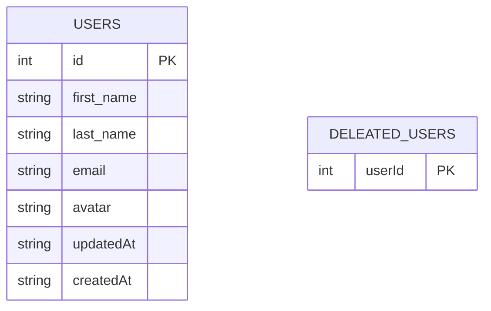

# Easy Sale - User Management Android App

## Overview

Android application that demonstrates user management functionality. It allows users to view, create, edit, and delete user profiles. The app uses a combination of local storage and remote API calls to manage user data efficiently.

## Features

- Display a list of users
- Add new users
- Edit existing user details
- Delete users
- Long-press selection for bulk actions
- Error handling with dialog popups

## Architecture

The app follows the MVVM (Model-View-ViewModel) architecture pattern and uses the following components:

- **View**: MainActivity, UserRecyclerViewAdapter
- **ViewModel**: UserViewModel
- **Model**: UserRepository, User, UserDAO
- **API**: Retrofit for network calls

## Dependencies

- AndroidX
- Lifecycle components
- RecyclerView
- Retrofit for API calls
- Room for local database
- Glide for image loading

## Setup

1. Clone the repository
2. Open the project in Android Studio
3. Sync the project with Gradle files
4. Run the app on an emulator or physical device

## API

The app uses the [ReqRes API](https://reqres.in/) for demonstration purposes. It fetches user data, creates new users, updates user information, and deletes users.

## Local Storage

Room database is used to cache user data locally. This allows for offline access and faster loading times.

## Main Components

- **MainActivity**: The main UI of the app, handling user interactions and displaying the list of users.
- **UserViewModel**: Manages UI-related data, handles business logic, and communicates with the UserRepository.
- **UserRepository**: Manages data operations, decides whether to fetch data from the local database or the remote API.
- **UserRecyclerViewAdapter**: Adapts user data for display in a RecyclerView.

## Error Handling

The app uses dialog popups to display error messages to the user, providing a better user experience than toast messages.

## Future Improvements

- Implement user authentication
- Add search functionality
- Improve UI/UX with material design components
- Implement data sync between local and remote storage

## Database Schema

The database schema consists of a single table for users:

* users table:
  * id: Integer, primary key, autoincrement
  * first_name: String
  * last_name: String
  * email: String
  * avatar: String
  * updatedAt: String (timestamp)
  * createdAt: String (timestamp)
    
* deleted_users table:
  * userId: Integer, primary key

